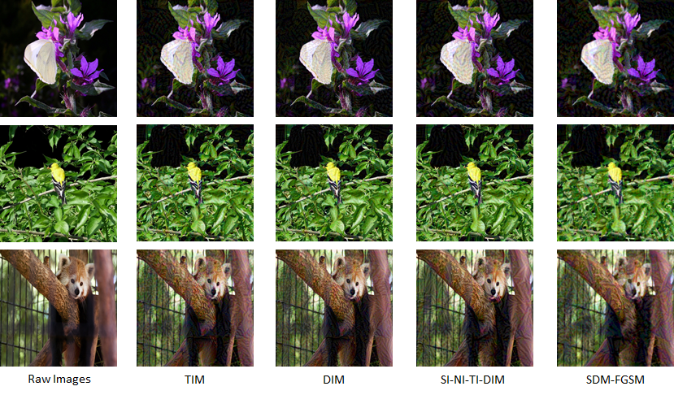

# Improving Transferability of Adversarial Examples by Saliency Distribution and Data Augmentation
Codes for reproducing "Improving Transferability of Adversarial Examples by Saliency Distribution and Data Augmentation".


This experiment code bases on Python 3.6.

## Software version
The program is developed under:
- tensorflow-gpu 1.14.0
- opencv-python 3.3.0.10
- opencv-contrib-python 3.3.0.10
- pandas 1.0.5
- numpy 1.18.5
- scipy 1.2.3

You can run
```
    pip install -r requirements.txt
```
to install the packages, or you can install them by conda.

## Datasets
We use NIPS 2017 adversarial learning development set as our test dataset, which consists of 1,000 images.
The image size is 299 x 299 x 3 and is saved in  `./datasets/images`.
The name, label and target class for each image is saved in `./datasets/images.csv`.
To generate the saliency map of each image, please run `saliency_map.py`, the results will be saved in `./datasets/saliency_maps`.

## Models
Pre-trained models are placed in `./checkpoints`

The Pre-trained models can be downloaded from ` TensorFlow-Slim image classification model library`

## Attack and Evaluate

To perform our attack, we provide an example below:

You should first generate the saliency map for each image. To generate the saliency map, you should run:
```
python saliency_map.py --input_dir ./datasets/images --output_dir ./datasets/saliency_maps/ --csv_file ./datasets/data.csv
```
Then use images and saliency maps to generate adversarial examples.
To perform our single-model attack, you should run:
```
python attack_single.py --model_type vgg_19 --input_dir ./datasets/images --output_dir ./results/vgg_19 --csv_file ./datasets/data.csv --saliency_maps ./datasets/saliency_maps --batch_size 50 --noise 32
```
Note that the batch_size depends on the GPU performance. 
Since the transferable targeted attack is more difficult on the single-model setting, we set the epsilon `noise` as `32`/255 in the `l-infinity` norm.


To perform our ensembled attack, you should run:
```
python attack_ensemble.py --input_dir ./datasets/images --output_dir ./results/ensemble --csv_file ./datasets/data.csv --saliency_maps ./datasets/saliency_maps --batch_size 20 --noise 16
```
The generated adversarial examples are saved in `./results`.

After that, you can evaluate the effect of our attack. We offer several models to evaluate:

```
vgg_19|inception_v4|inc_res_v2|ens_adv_inception_resnet_v2|ens3_adv_inception_v3|ens4_adv_inception_v3|res_v2_152
```

To evaluate our result on a model (for example, `inception_v4`), you should run the following command:
```
python test_accuracy.py --input_dir ./results/vgg_19 --csv_file ./datasets/data.csv --batch_size 100 --model_type inception_v4 --log test-log.txt
```
The evaluation result will be saved in `test-log.txt`.
## Results
We display some adversarial examples of our approach and compare with other adversarial examples generated by the state-of-the-art methods in `results.jpg`.

